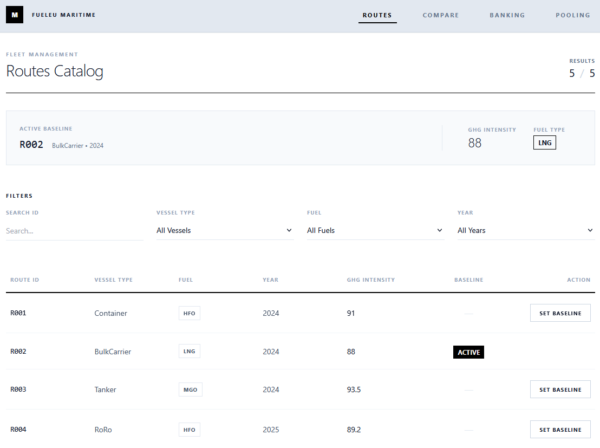
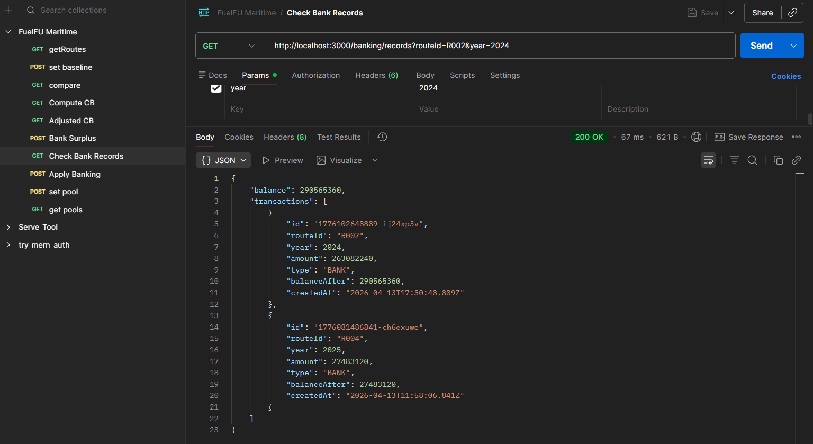
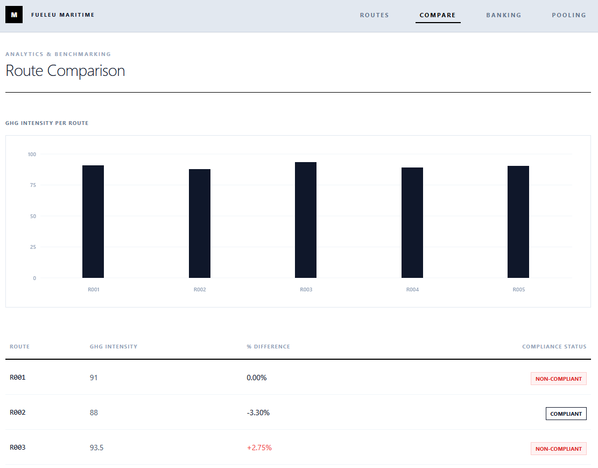
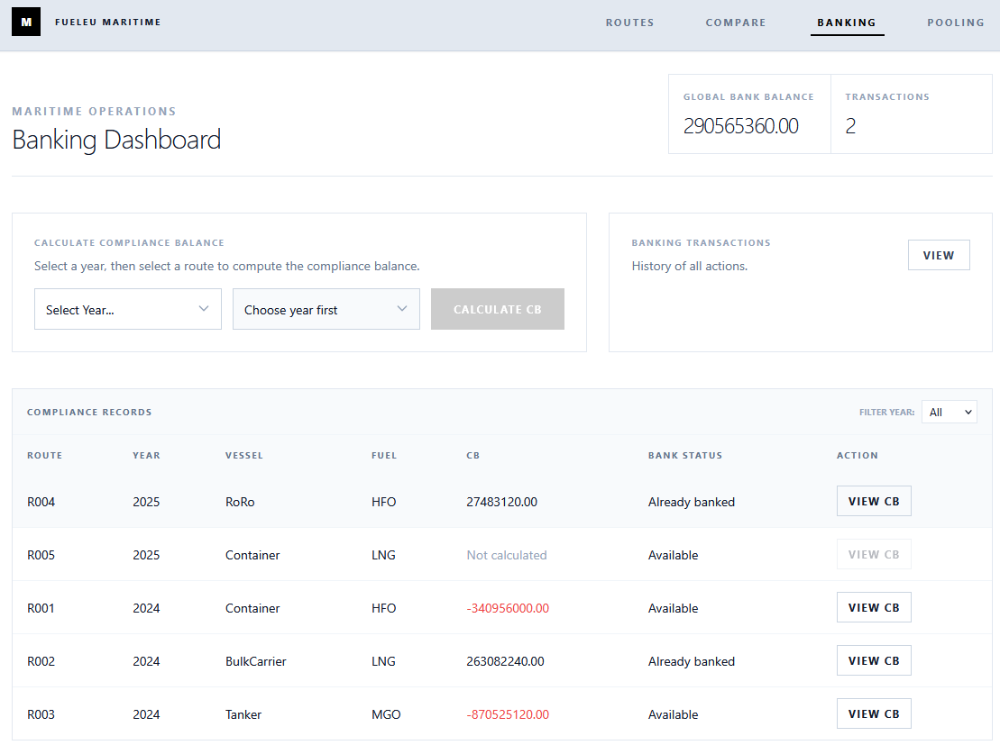
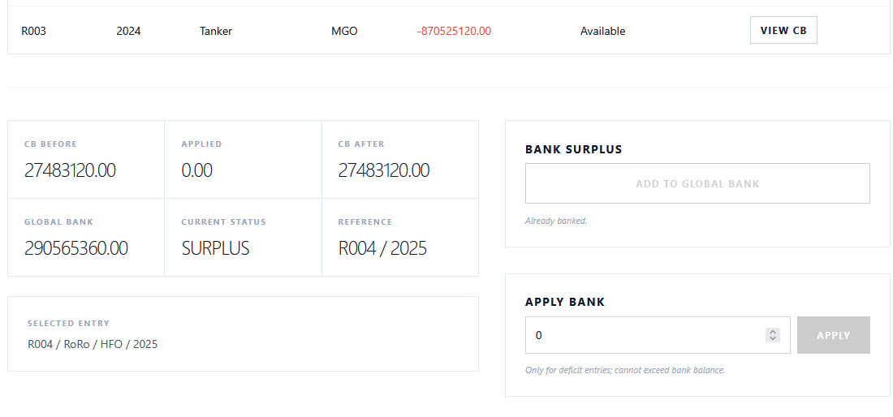
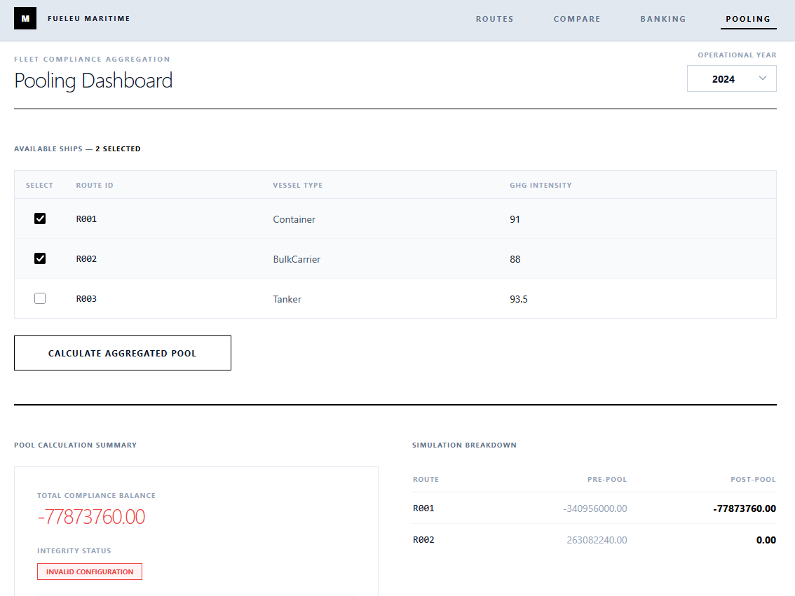

# FuelEU Compliance Platform

## Overview

This repository contains a full-stack FuelEU compliance simulation platform with:

- A **backend API** for route compliance calculations, banking, and pooling.
- A **frontend dashboard** for route comparison and compliance operations.

The project models domain workflows such as baseline route handling, compliance balance (CB) computation, surplus banking, and pooling members into a shared compliance group.



## Architecture (Hexagonal Structure)

The backend follows a hexagonal architecture (ports and adapters):

- **Domain/Core (`backend/src/core`)**
  - Entities, business rules, and application use cases (`ComputeCB`, `BankSurplus`, `CreatePool`, etc.).
- **Inbound Adapters (`backend/src/adapters/inbound/http`)**
  - Express controllers that expose REST endpoints.
- **Outbound Adapters (`backend/src/adapters/outbound/postgres`)**
  - PostgreSQL repository implementations for core ports.
- **Infrastructure (`backend/src/infrastructure`)**
  - Application wiring (`app.ts`), DB initialization/seed (`db.ts`), and server startup (`server.ts`).

High-level request flow:

1. HTTP request enters an inbound controller.
2. Controller calls a core use case.
3. Use case interacts through repository ports.
4. Postgres adapters implement those ports and persist/query data.
5. Controller returns response JSON.

Frontend structure mirrors a similar separation:

- `fueleu-frontend/src/core` for business-facing logic/contracts.
- `fueleu-frontend/src/adapters` for API clients and UI hooks.
- `fueleu-frontend/src/pages` for route/compliance/banking/pooling screens.

## Setup & Run Instructions

### Prerequisites

- Node.js 18+ (recommended)
- npm 9+
- PostgreSQL (local or remote)

### 1) Clone and install dependencies

From repository root:

```bash
cd backend
npm install

cd ../fueleu-frontend
npm install
```

### 2) Configure backend environment

Create or update `backend/.env`:

```env
PORT=3000
PGHOST=localhost
PGPORT=5432
PGDATABASE=postgres
PGUSER=postgres
PGPASSWORD=your_password_here
```

### 3) Start backend

```bash
cd backend
npm run dev
```

Backend runs at `http://localhost:3000`.

### 4) Start frontend

In a second terminal:

```bash
cd fueleu-frontend
npm run dev
```

Frontend runs at Vite's local URL (typically `http://localhost:5173`).

## How to Execute Tests

Backend tests:

```bash
cd backend
npm run test
```

## Sample Requests / Responses

Base backend URL:

```text
http://localhost:3000
```

### 1) List routes

Request:

```bash
curl http://localhost:3000/routes
```

Sample response:

```json
[
  {
    "routeId": "R001",
    "vesselType": "Container",
    "fuelType": "VLSFO",
    "year": 2025,
    "ghgIntensity": 91.2,
    "fuelConsumption": 3000,
    "distance": 12000,
    "totalEmissions": 273600,
    "isBaseline": true
  }
]
```

### 2) Compute compliance balance (CB)

Request:

```bash
curl -X POST http://localhost:3000/compliance/cb \
  -H "Content-Type: application/json" \
  -d "{\"routeId\":\"R001\",\"year\":2025}"
```

Sample response:

```json
{
  "routeId": "R001",
  "year": 2025,
  "cb": 145.37
}
```

### 3) Bank surplus

Request:

```bash
curl -X POST http://localhost:3000/banking/bank \
  -H "Content-Type: application/json" \
  -d "{\"routeId\":\"R001\",\"year\":2025}"
```

Sample response:

```json
{
  "message": "Surplus banked successfully",
  "routeId": "R001",
  "year": 2025
}
```

### 4) Create pool

Request:

```bash
curl -X POST http://localhost:3000/pools \
  -H "Content-Type: application/json" \
  -d "{\"routeIds\":[\"R001\",\"R002\"],\"year\":2025}"
```

Sample response:

```json
{
  "id": "pool_2025_001",
  "year": 2025,
  "members": [
    {
      "routeId": "R001",
      "year": 2025,
      "cb_before": 145.37,
      "cb_after": 72.68
    },
    {
      "routeId": "R002",
      "year": 2025,
      "cb_before": 0,
      "cb_after": 72.69
    }
  ]
}
```



## Frontend Views

Primary pages:

## Routes


## Compare


## Banking



## Pooling
